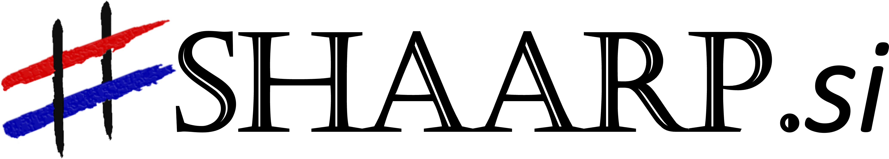
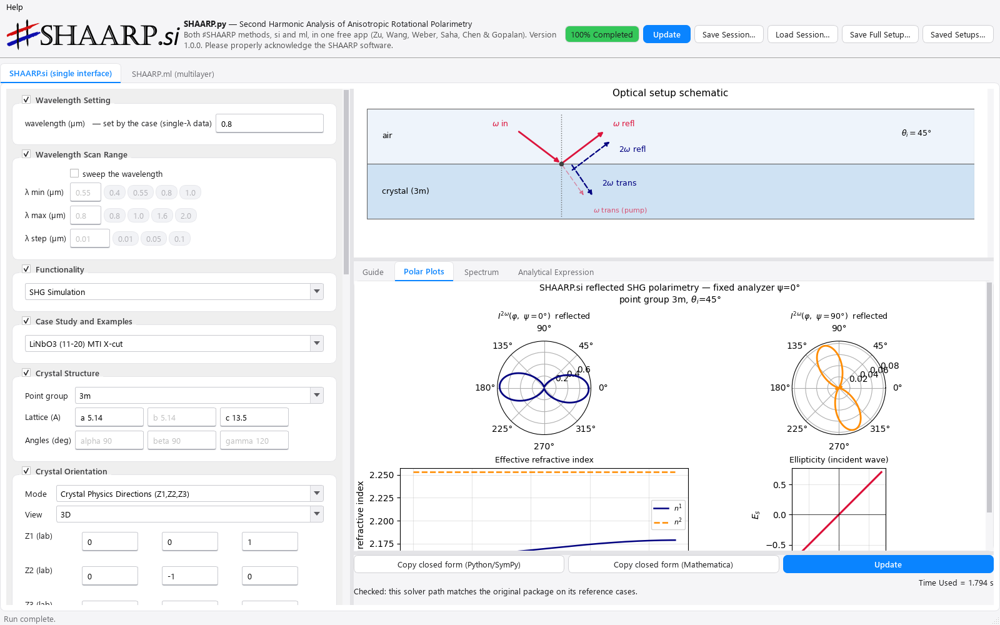
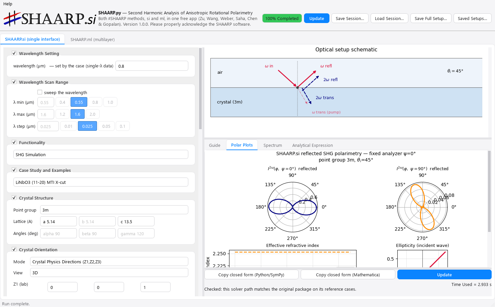
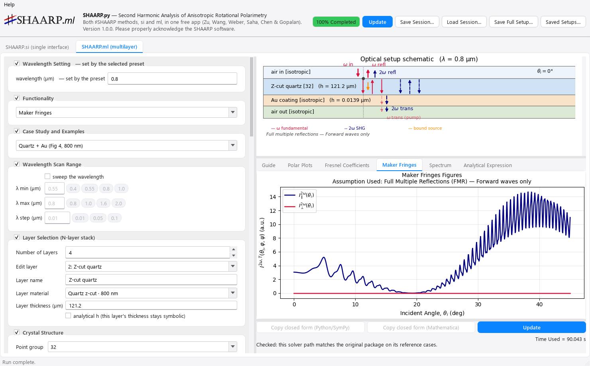
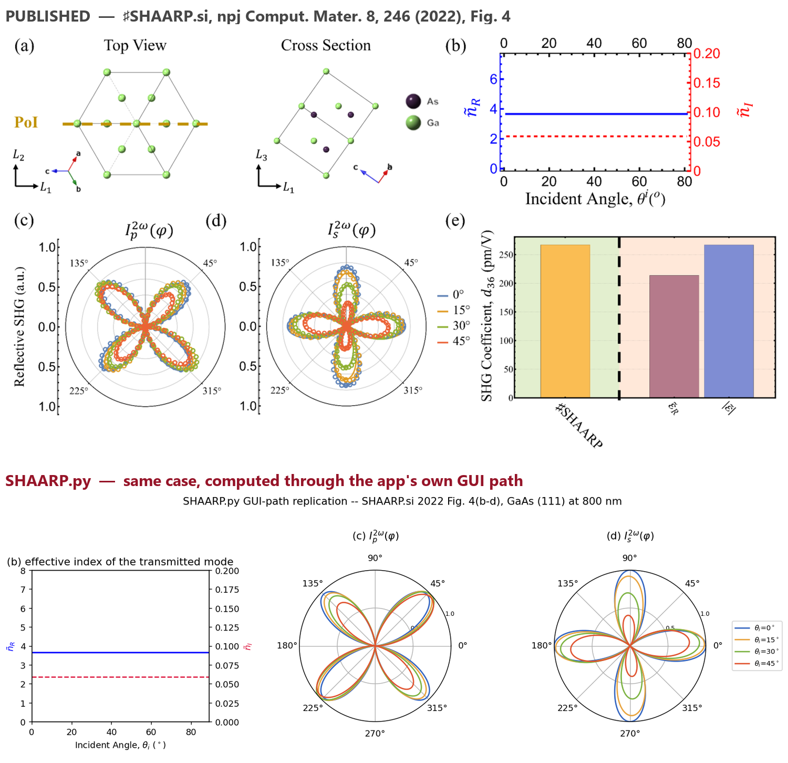

<div align="center">

<picture>
  <source media="(prefers-color-scheme: dark)" srcset="docs/_static/shaarp_si_logo_dark.png">
  
</picture>
&nbsp;&nbsp;&nbsp;
<picture>
  <source media="(prefers-color-scheme: dark)" srcset="docs/_static/shaarp_ml_logo_dark.png">
  
</picture>

# SHAARP.py

**Optical second-harmonic generation in anisotropic crystals and multilayers**
<br>
*Both published ♯SHAARP packages, one Python library and one desktop app.*

[](https://github.com/Rui-Zu/SHAARP.py/releases)
[](https://github.com/Rui-Zu/SHAARP.py/actions/workflows/ci.yml)
[](https://www.python.org/downloads/)
[](LICENSE)
[](https://api.visitorbadge.io/api/visitors?path=https%3A%2F%2Fgithub.com%2FRui-Zu%2FSHAARP.py&countColor=%23263759&style=flat)

</div>

**The Python edition of ♯SHAARP** — *Second Harmonic Analysis of Anisotropic Rotational
Polarimetry* — for simulating and fitting optical second-harmonic generation (SHG) in anisotropic
crystals and multilayers. It brings both published Mathematica packages together:

- **♯SHAARP.si** — single-interface reflected SHG polarimetry for any SHG-active point group and
  orientation (*npj Comput. Mater.* **8**, 246 (2022)) · original Mathematica package:
  [github.com/Rui-Zu/SHAARP](https://github.com/Rui-Zu/SHAARP)
- **♯SHAARP.ml** — multilayer / Maker-fringe SHG with complete multiple reflections
  (Full / Jerphagnon–Kurtz / Herman–Hayden assumptions) (*npj Comput. Mater.* **10**, 64 (2024)) ·
  original Mathematica package: [github.com/bzw133/SHAARP.ml](https://github.com/bzw133/SHAARP.ml)

Every solver stage is validated **value-by-value against the original live Mathematica
packages** at the exported reference points — typically 10⁻¹³–10⁻¹⁷, with the largest
documented deviation 3.6×10⁻⁹ — and the automated test suite gates every claim. What that
does and does not cover is set out in
[docs/residual_risks.md](docs/residual_risks.md). Beyond the
originals, it adds closed-form symbolic SHG expressions and **d-tensor extraction** from
polarimetry scans.

There are two ways to use it, and **you do not need to know Python for the first one**:

<table>
<tr>
<td valign="top">

### 🖥️ [Run the app](#run-the-app-no-python-needed)

Download, double-click, click **Update**.<br>
No Python, no installation.

**← Start here if you just want results.**

</td>
<td valign="top">

### 🐍 [Use it from Python](#use-it-from-python)

Script it, batch it, fit your own data.<br>
Setup walked through from scratch.

**← Start here if you want to automate.**

</td>
</tr>
</table>

---

## Run the app (no Python needed)

The same solvers behind a point-and-click window — both packages merged into one app, two tabs.
Download, extract, run.

<div align="center">



<sub>The desktop app — LiNbO₃ (3m) reflected SHG polarimetry, computed and plotted in one click.</sub>

</div>

<table>
<tr>
<td width="50%" align="center"><br><sub><b>SHAARP.si tab</b> — single-interface reflected SHG</sub></td>
<td width="50%" align="center"><br><sub><b>SHAARP.ml tab</b> — multilayers &amp; Maker fringes</sub></td>
</tr>
</table>

**Step 1 — download.** Go to this repository's **[Releases](../../releases)** page and pick the
file for your computer (open the newest release and look under *Assets*):

| Your computer | Download | Then |
|---|---|---|
| Windows (64-bit) | `SHAARP_py_v…_win64.zip` | unzip, double-click `SHAARP_py\SHAARP_py.exe` |
| macOS (Apple Silicon) | `SHAARP_py_v…_macos.zip` | unzip, open `SHAARP_py/SHAARP_py.app` (see the note below) |

On any other system — or if the Releases page is empty, meaning no packaged build has been
published yet — run it from Python instead: see **[Use it from Python](#use-it-from-python)**
below.

**Step 2 — first launch.**

- **Windows** may show a blue "Windows protected your PC" box because the app is not
  code-signed → **More info → Run anyway**.
- **macOS** blocks unsigned apps on the first open. One-time fix: on macOS 15 and newer, try to
  open it once, then go to **System Settings → Privacy & Security** and click **"Open Anyway"**;
  on macOS 14 and older, **right-click (Control-click) the app → Open → Open**. Terminal
  alternative: `xattr -dr com.apple.quarantine SHAARP_py.app`.

**Step 3 — your first calculation.**

1. The app opens on the **♯SHAARP.si** tab. Leave everything as it is.
2. In **Case Study and Examples**, pick **GaAs (111)** — one of the four worked cases of the 2022
   paper, listed under *Cases in DOI* (all at 800 nm).
3. Click **Update / Run**. The reflected SHG polarimetry *I*ₚ(φ) / *I*ₛ(φ) polar plots appear next
   to a schematic of the sample.
4. Now click the **♯SHAARP.ml** tab, keep the preset **Quartz + Au (Fig 4, 800 nm)**, set
   *Functionality* to **Maker Fringes**, and click **Update / Run** — the transmitted SHG fringes
   of the 2024 paper's Fig-4 heterostructure appear.
5. From there, explore: the case lists carry the complete original case-study palettes at their
   published wavelengths (materials measured at several wavelengths are grouped under one title),
   the papers' heterostructure presets, and an N-layer stack editor for your own samples.

Hover any control for an explanation, and use **Help → User Guide** inside the app for the full
workflow. Every number the app shows comes from the same validated solvers described above.

---

## Use it from Python

For scripting, batch runs, and fitting your own measurements.

**Install it with one command.** You do not need to download or clone anything:

```bash
pip install "shaarp-py[desktop,symbolic] @ git+https://github.com/Rui-Zu/SHAARP.py"
```

That pulls in the solvers, the closed-form symbolic tools, and the desktop GUI, and takes a minute
or two. You now have `import shaarp` available anywhere, plus a `shaarp-gui` command that launches
the same desktop app.

<details>
<summary>If you are new to Python, or that command did not work</summary>

**No Python yet?** Install it from [python.org/downloads](https://www.python.org/downloads/) —
version 3.10 or newer. On Windows, tick **"Add python.exe to PATH"** on the installer's first
screen; that one checkbox prevents most beginner problems. Then open a terminal (Windows: press
Start, type `cmd`; macOS: open Terminal) and check with `python --version`.

**`pip` not found?** Use `python -m pip install ...` instead — same line otherwise.

**Smaller installs.** Pick one; NumPy, SciPy and matplotlib always come along. Replace the
bracketed part of the command above with:

| Instead of `[desktop,symbolic]` | You get |
|---|---|
| *(nothing)* | solvers only — polarimetry, Maker fringes, Fresnel |
| `[symbolic]` | + closed-form symbolic expressions and d-extraction (SymPy) |
| `[interactive]` | + the Jupyter-widget session (ipywidgets) |

**Want to read or edit the source?** Clone the repository and install it in place:

```bash
git clone https://github.com/Rui-Zu/SHAARP.py
cd SHAARP.py
pip install -e ".[desktop,symbolic]"
```

The repository also carries the benchmark data, the notebooks, and the test suite, none of which
are needed to use the library.

</details>

**Your first calculation.** Save the following as `first_shg.py` and run it with
`python first_shg.py`:

```python
import matplotlib.pyplot as plt

import shaarp

# Maker fringes of the paper's Fig-4 quartz + Au heterostructure (the SHAARP.ml workflow).
# `compute_ml_gui_result` is the app's *Update* button, headless — same arguments, same result.
ml = shaarp.compute_ml_gui_result(
    "Maker Fringes", system_preset="Quartz + Au (Fig 4, 800 nm)",
    theta_min_deg=0.0, theta_max_deg=45.0, theta_step_deg=0.5)

# transmitted 2ω intensity (arbitrary units) vs incidence angle in degrees
plt.plot(ml.numeric["theta_deg"], ml.numeric["parallel_intensity"])
plt.xlabel("incidence angle θᵢ (deg)"); plt.ylabel("transmitted 2ω intensity (a.u.)")
plt.show()
```

These are the very same compute paths the app's *Update* button runs — headless.

**Two ways in, and they meet.** `compute_si_gui_result` / `compute_ml_gui_result` mirror the app
one-to-one, so anything you can click you can script. Underneath them sit the `run_*` facades —
`run_si_numeric`, `run_ml_numeric`, `run_maker_fringes`, `run_fresnel_sweep`, `run_sample_rotation`,
`run_si_full_analytical`, `run_ml_partial_analytical` — which give you the solver stages directly
and are what [`docs/usage.md`](docs/usage.md) and the API reference document. Start with whichever
matches how you think; they compute the same physics.

### Where to go next

| I want to… | Go to |
|---|---|
| Learn the Python API step by step | [`notebooks/SHAARP_py_step_by_step.ipynb`](notebooks/SHAARP_py_step_by_step.ipynb) |
| See worked, plotted examples | [`examples/`](examples/) — six runnable scripts (polarimetry, Maker fringes, d-extraction) |
| Reproduce the two papers | [the two notebooks below](#reproduce-the-papers) |
| Learn the layered API (`run_*` facades) | [`docs/usage.md`](docs/usage.md) |
| Drive the app from a notebook | [`notebooks/SHAARP_py_interactive_session.ipynb`](notebooks/SHAARP_py_interactive_session.ipynb) |
| Read the conventions / FAQ | [`docs/conventions.md`](docs/conventions.md) · [`docs/guide/faq.md`](docs/guide/faq.md) |
| Check what is validated, and how | [`docs/validation.md`](docs/validation.md) · honest gaps: [`docs/residual_risks.md`](docs/residual_risks.md) |
| Read the full solver-stage reference | [`docs/technical_reference.md`](docs/technical_reference.md) |

---

## What's in the box

| Path | Deliverable |
|---|---|
| `shaarp/` | The package: numeric + symbolic SHG solvers, polarimetry, Maker fringes, Fresnel, rotational-anisotropy scans, d-extraction, case-study materials with Mathematica-exported dispersion, and the desktop GUI source |
| `notebooks/` | Paper reproductions, step-by-step tutorial, interactive session, benchmark dashboard |
| `examples/` | Small runnable scripts with figures |
| `benchmarks/` | Frozen live-Mathematica reference exports + the comparison tooling (no Mathematica needed to run tests) |
| `docs/` | Full Sphinx site: GUI guide, API reference, tutorials, conventions, validation evidence |
| `tests/` | The gated validation suite |

## How it works

Reflected/transmitted SHG is solved as one boundary-value problem, in the same six stages as the
original packages: anisotropic eigenmodes per medium → linear (ω) boundary conditions → nonlinear
source polarization **P**²ω = ε₀ **d** : **E**ω**E**ω → the driven (inhomogeneous) 2ω wave →
2ω boundary conditions across every interface → observables (polarimetry *I(φ)*, Maker fringes
*I(θᵢ)*, azimuth scans). Multilayers chain per-interface blocks with exact phase propagation under
the three multiple-reflection assumptions (FMR / JK / HH). The complete solver-stage reference
lives in [`docs/technical_reference.md`](docs/technical_reference.md).

## Reproduce the papers

Two notebooks reproduce **every case figure of both SHAARP papers** beside the actual paper
panels, with every parameter provenance-cited from the original case studies:

| Notebook | Paper |
|---|---|
| [`notebooks/Reproduce_SHAARP_si_paper.ipynb`](notebooks/Reproduce_SHAARP_si_paper.ipynb) | ♯SHAARP.si (2022): GaAs (111), LiNbO₃ (112̄0), KTP (100), TaAs (112) polarimetry |
| [`notebooks/Reproduce_SHAARP_ml_paper.ipynb`](notebooks/Reproduce_SHAARP_ml_paper.ipynb) | ♯SHAARP.ml (2024): quartz Maker fringes (HH/JK/FMR + the Herman-1995 analytic benchmark), quartz + Au, LiNbO₃/KTP and ZnO//Pt//Al₂O₃ polarimetry, LiNbO₃//quartz interference, twisted-bilayer MoS₂ |

<div align="center">



<sub>The published figure and ours, same case, same axes — GaAs (111) at 800 nm, run through the app's own GUI path.</sub>

</div>

Regenerate with `python build_paper_notebooks.py`.

## Documentation

```bash
pip install -r docs/requirements.txt
python -m sphinx -b html docs docs/_build/html
```

Then open `docs/_build/html/index.html`.

## Please cite

1. Zu, R., Wang, B., He, J. *et al.* Analytical and numerical modeling of optical second harmonic
   generation in anisotropic crystals using ♯SHAARP package. *npj Comput. Mater.* **8**, 246
   (2022). doi:10.1038/s41524-022-00930-4
2. Zu, R., Wang, B., He, J. *et al.* Optical second harmonic generation in anisotropic multilayers
   with complete multireflection of linear and nonlinear waves using ♯SHAARP.ml package.
   *npj Comput. Mater.* **10**, 64 (2024). doi:10.1038/s41524-024-01229-2

## License

GNU General Public License v3 — see [LICENSE](LICENSE).
